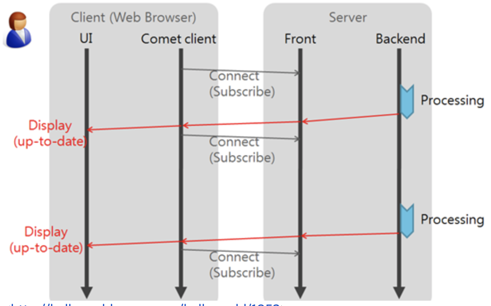
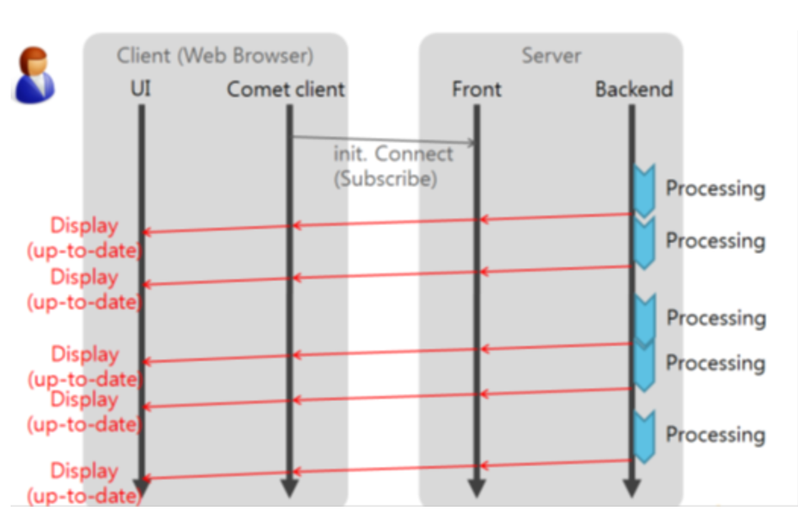

# 웹 브라우저 에서의 양바향 통신 방법 
   
## Polling
</img><br/>
```
클라이언트에서 일정 주기마다 요청을 보내고 서버는 현재 상태를 바로 응답하는 방식입니다.
이 방식은 실시간으로 반영되는 것이 중요한 서비스에는 별로 좋지 않고 서버에서 변화가 없더라도 매 요청마다 응답을 내려주기 때문에 불필요한 트래픽이 발생하게 됩니다.
```
## Long Polling
</img><br/>
```
클라이언트에서 요청을 보내고 서버에서는 이벤트가 발생했을 때 응답을 내려주고 클라이언트가 응답을 받았을때 다시 다음 응답을 기다리는 요청을 보내는 방식입니다.

실시간 반응이 가능하고 polling에 비해서 불필요한 트래픽은 유발하지는 않지만 오히려 이벤트가 잦다면 순간적으로 과부하가 걸리게 됩니다.
```
## Streaming
</img><br/>
```
이벤트가 발생했을때 응답을 내려주는데 응답을 완료시키지 않고 계속 연결을 유지하는 방식입니다.
Long Polling에 비해 응답마다 다시 요청을 하지 않아도 되므로 효율적이지만, 연결 시간이 길어질수록 연결의 유효성 관리의 부담이 발생합니다.
```
## WebSocket
</img><br/>
```
websocket이란 웹 서버와 웹 브라우저간 실시간 양방향 통신환경을 제공해주는 실시간 통신 기술입니다. 위의 Polling 방식(요청-응답방식)과 다르게 양방향으로 원할때 요청을 보낼 수 있으며 stateless한 HTTP에 비해 오버헤드가 적으므로 유용하게 사용할 수 있습니다.
```
## Socket.io란?
```
socket.io는 웹소켓을 이용해 클라이언트에 실시간으로 데이터를 전송한다.
socket.io는 Socket을 구현한것으로 WebSocket 개발을 쉽게 하기 위한 것이다.
클라이언트에서 Event Listener로 새로운 정보를 받아 정보를 업데이트할 수 있다.
```

<span style="color:red">가장 중요한점은 webSocekt을 지원하지 않는 브라우저에 대해서도 호환되는 기술을 자동선택 한다는 점이다.
WebSocket, FlashSocket, AJAX Long Polling, Ajax Multi part Streaming, IFrame, JSONP Polling 를 하나로 추상화 한것이다.</span>