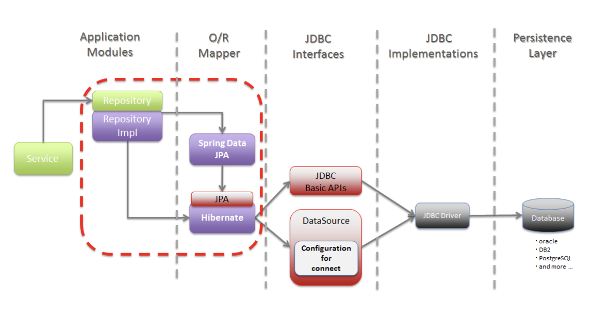
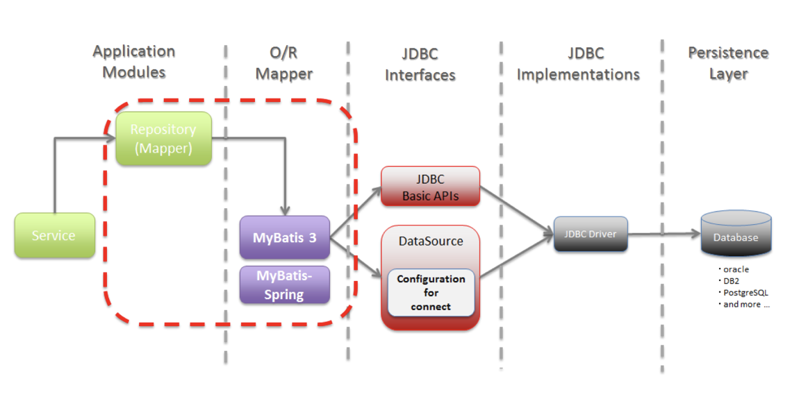

# Mybatis VS Hibernate

## SQL Mapper
* SQL <- 매핑 -> Object 필드
* SQL Mapper는 SQL 문장으로 직접 데이터베이스 데이터를 다룬다.
  * 즉, SQL Mapper는 SQL을 명시해줘야 한다.
  * EX) Mybatis, JdbcTemplates 등

<br>

## ORM(Object-Relational Mapping) , 객체 - 관계 매핑
* 데이터베이스 데이터 <- 매핑 -> Object 필드
  * 객체를 통해 간접적으로 데이터베이스 데이터를 다룬다.
* 객체와 관계형 데이터베이스의 데이터를 자동으로 매핑(연결)해주는 것을 말한다.
  * ORM을 이용하면 SQL Query가 아닌 직관적인 코드(메서드)로 데이터를 조작할 수 있다.
  * 객체 간의 관계를 바탕으로 SQL을 자동으로 생성한다.

## JPA(Java Persistent API)

java ORM 기술에 대한 API 표준 명세로, Java에서 제공하는 API

## Hibernate
* JPA의 구현체 중 하나
* Hibernate가 지원하는 메서드 내부에서는 JDBC API가 동작한다.
* 객체지향적으로 사용한다

```
@Entity
public class User {
	@Id
	private String id;
	private String pwd;
	private String nickname;
 }
```

## Mybatis
* 개발자가 지정한 SQL, 저장 프로시저 그리고 몇 가지 고급 매핑을 지원하는 SQL Mapper이다.
* JDBC로 처리하는 상당 부분의 코드와 파라미터설정 및 결과 매핑을 대신해준다.
* JPA에 비해서 복잡한 쿼리에 우수한 성능을 보인다.

<br>



```
<?xml version="1.0" encoding="UTF-8"?>
<!DOCTYPE mapper
PUBLIC "-//mybatis.org//DTD Mapper 3.0//EN"
"http://mybatis.org/dtd/mybatis-3-mapper.dtd">
<mapper namespace="com.naver.dbtest.repo.UserRepo">

	<insert id="insert" parameterType="user">
		insert into
		user(id,pwd,nickname) values(#{id},#{pwd},#{nickname})
	</insert>

	<select id="selectOne" parameterType="user" resultType="user">
		select
		id, pwd, nickname from user where id = #{id}
	</select>

	<select id="selectAll" resultType="user">
		select
		id, pwd, nickname from
		user
	</select>
</mapper>
```
