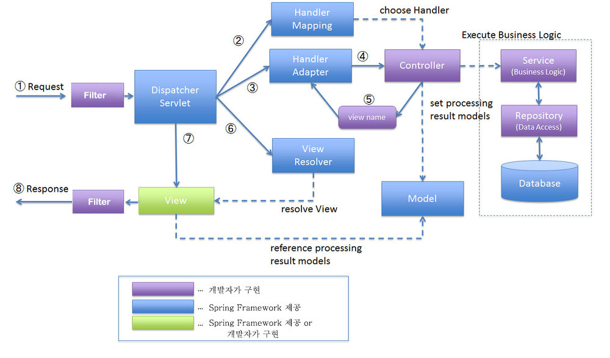

# Spring 처리 과정

1. 브라우저로부터 <strong>Request</strong>가 들어오면 일단 <strong>Filter</strong>를 거친다.
   - web.xml ex) 인코딩을 UTF-8로 설정하는 필터
2. <strong>DispatcherServlet</strong>이 <strong>Controller</strong>에 요청을 전달하기 전에 가로챈다. 각 요청을 <strong>HandlerMapping</strong>을 통해 요청에 해당하는 적절한 <strong>Controller</strong>를 찾아서 전달한다.
3. <strong>DispatcherServlet</strong>은 실행할 <strong>Controller</strong> 객체를 <strong>HadlerAdapter</strong>에 전달한다.
4. <strong>HandlerAdapter</strong>는 해당 <strong>Controller</strong>를 호출한다.
5. <strong>Controller</strong>에서는 전달된 요청을 처리한다.
    - 예를 들어 게시판의 글 목록을 가져오는 요청을 받으면 <strong>Controller</strong>는 게시판 <strong>Service</strong>를 호출하고 <strong>Service</strong>에서는 DAO를 통해 게시판 글 목록을 가져오게 된다.
    - 요청을 처리한 후 결과를 <strong>Model</strong>에 담고, View의 이름과 함께 <strong>ModelAndView</strong> 객체로 <strong>HandlerAdapter</strong> 거쳐 <strong>DispatcherServlet</strong>으로 전달한다.
6. <strong>DispatcherServlet</strong>은 전달받은 <strong>ModelAndView</strong> 객체를 <strong>ViewResolver</strong>로 전달하고, <strong>ViewResolver</strong>는 view name에 해당하는 <strong>view</strong>를 찾아서 전달한다.
7. <strong>DispathcerServlet</strong>은 반환된 <strong>View</strong>에 응답 결과 생성을 요청하고 웹 브라우저를 통해 클라이언트에 응답한다.

이 과정에서 HTML파일로 전달된다. View에 렌더링해서 자체를 넘겨줘도되고 REST API를 이용해서 JSON이나 xml 형태로 전달한다.

# 구성요소

## DispatcherServlet (OSI 6계층)
- 클라이언트의 실제 요청을 처리
- 모든 열결을 담당하는 창구역할

## HandlerMapping
- 클라이언트의 요청 경로(URI)에 부합하는 <strong>Controller</strong> 객체를 찾는다.

## HandlerAdapter
- <strong>HandlerMapping</strong>을 통해 찾은 컨트롤러 객체를 실행한다.
- @Controller 애노테이션을 적용한 컨트롤러, 스프링2.5까지 주로 사용됐던 Controller 인터페이스를 구현한 컨트롤러, 특수 목적으로 사용되는 HttpRequestHandler 인터페이스를 구현한 클래스를 동일한 방식으로 실행시켜준다.
- <strong>DispatcherSelvet</strong>객체는 실행 결과를 ModelAndView 타입으로만 받기 때문에 처리 결과를 ModelAndView 타입으로 변환해 준다.

## ViewResolver
- 전달받은 ModelAndView에는 view name을 담고 있으므로 해당하는 view name을 통해서 부합하는 view를 찾는다.