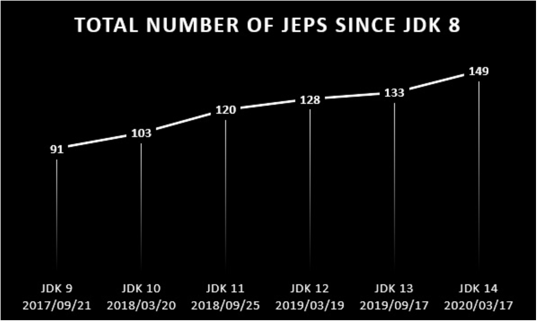

# JDK8
JDK8은 현재 가장 많이 사용되고 있는 안정화된 JAVA 버전으로 공식 업데이트 기간은 종료되었지만 많이 사용되고 있는 만큼 추가 지원기간이 꽤 길게 잡혀있다.
- 현재 최신버전은 람다식 표현 추가
- stream API 추가

# JDK11
JDK11부터 LTS(Long Term Support)가 생겨났으며 Premire + Extended Support로 최대 8년간 보안 업데이트와 버그 수정 지원을 받을 수 있게 되었다.

# 향상된 차이

## Docker 컨테이너의 향상된 기능
JAVA10 이전에 컨테이너에 설정된 메모리 및 CPU 제약 조건은 JVM에서 인식되지 않았습니다. 예를들어 JAVA8에서 JVM은 최대 힙 크기의 기본값을 기본 호스트의 실제 메모리의 1/4로 설정합니다. JAVA10부터는 JVM은 컨테이너 제어 그룹(cgroup)에 의해 설정된 제약 조건을 사용하여 메모리 및 CPU 제한을 설정합니다.

Docker 컨테이너 사용자가 JAVA힙에 사용되는 시스템 메모리 양을 세부적으로 제어할 수 있도록 JVM 옵션도 추가되었습니다.

## 통합 로깅
JAVA11에는 JVM의 모든 구성 요소에 대한 일반적인 로깅 시스템이 있습니다. 이 통합 로깅 시스템을 통해 사용자는 무슨 구성 요소를 어느 수준까지 로깅할지 정의할 수 있습니다. 이 세분화된 로깅은 JVM 충돌에 대한 근본 원인 분석을 수행하고 프로덕션 환경에서 성능 문제를 진단하는데 유용합니다.

## 모듈
 작은 최적의 런타임 이미지를 만들기 위해 : java 8 같은 경우에는 자바 실행(런타임) 환경에서 기본적으로 250MB 용량의 java.lang / java.tuil / java.se 패키지들을 모두 가져와서 프로그램을 비효율적으로 실행해야 한다. Java 11 부터는 모든 패키지들을 기능별로 모듈화 해놓았기 때문에 필요한 모듈만 가져와서 프로그램을 실행할 수 있기 때문에 효과적이다.
 <strong>MSA 시스템에서 유리하다</strong>