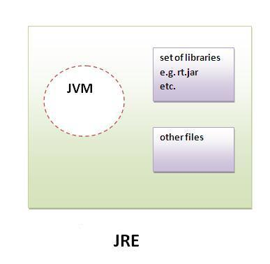
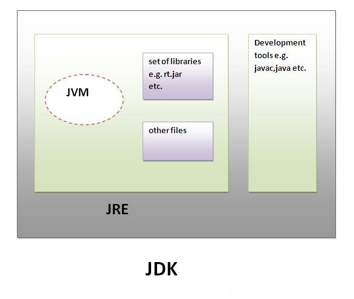
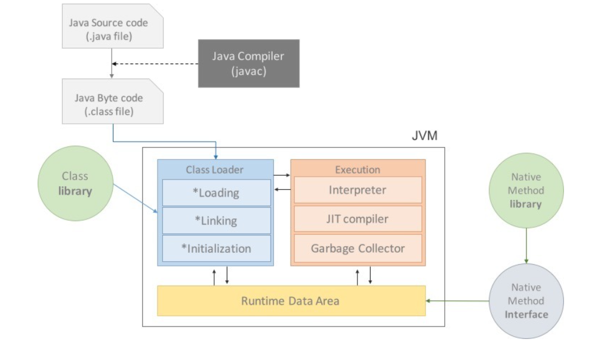
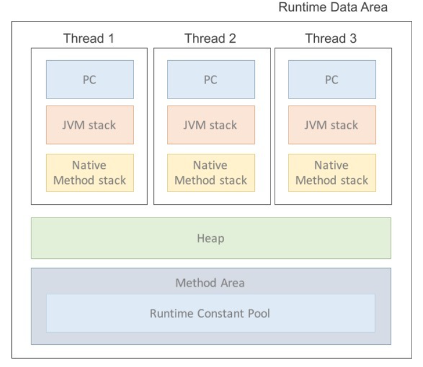
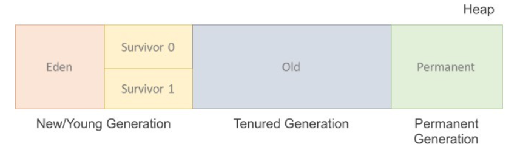
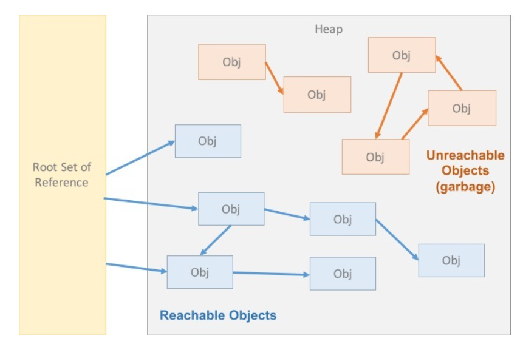

# JRE , JDK , JVM ??

## JRE


## JDK


## JVM 이란?

JVM ==> <strong>JAVA Virtual Machine</strong>
```
가상머신이란 프로그램의 실행하기 위해 물리적 머신과 유사한 머신을 소프트웨어로 구현 한것이다. 특징으로는 OS에 종속적이지않고 하나의 자바코드로 동작하게 해준다.
```

# JVM 동작과정


## Class Loader
```
.class 파일을 로드하고 링크를 통해 비치하는 작업을 수행하는 모듈이다.
Runtime 시에 동적으로 클래스를 로더한다.
현재 사용하는 Class스는 메모리에서 JVM에 탑재하고 사용하지 않는 Class는 제거한다.
```

## Execution Engine
```
Class Loader가 JVM내의 Runtime data 영역에 바이트 코드를 배치하면 Execution Engine에 의해 실행된다. JAVA ByteCode로 실행되며 이때 2가지 동작방식이 생긴다.
```

## Interpreter(인터프리터)
```
Execution Engine이 Byte Code 단위로 한줄 한줄 읽으면서 실행한다. 인터프리터언어의 장점을 가지고 있지만 단점은 느리다는 것 이것을 보완하는게 JIT이다.
```

## JIT(Just - in - Time)
```
인터프리터 방식의 단점을 보완하기 위해 도입된 JIT 컴파일러이다. 인터프리터 방식으로 실행하다가 호출이 많은 ByteCode들을 부분적으로 네이티브 코드로 직접 실행한다.
이렇게 네이티브 코드가된것은 캐시로 저장하기 때문에 자주수행하는 코드들은 빠른 실행을 보여준다.
```

# Runtime Data Area


# GC (Garbage Colletion)



## Minor GC
새로 생성된 대부분의 객체는 Eden 영역에 위치, Eden 영역에서 GC가 발생 후 살아남은 객체는 Survior 영역 중 하나로 이동 이과정을 반복하다가 살아남은 객체는 Old 영역으로 이동.

## Major GC
Old영역에 있는 모든 객체들을 검사하여 참조되지 않은 객체들을 한꺼번에 삭제한다. 시간이 오래 걸리고 실행 중 프로세스가 정지된다. 이것을 'stop-ther-world'라고 한다.

