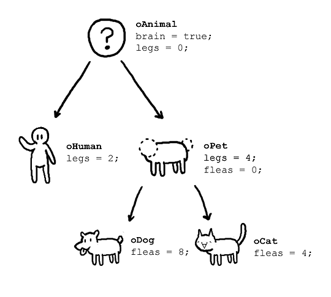

# Object Oriented Programming


### oop란 무엇일까?
```
컴퓨터언어는 정말 많다. 그 중에서도 BackEnd개발자가 주로 사용하는 JAVA의 언어의 특징인 OOP를 설명하고자 한다. 먼저 말하지만 "객체 지향 프로그래밍" 이름에서 알겠지만 JAVA라는 언어가 OOP다! 라는 말은 완벽하지 않다고 생각한다. JAVA라는 언어는 객체지향 프로그래밍을 쉽게 해주는 언어라고 생각하자!
```

### 그래서 객체 지향 프로그래밍(OOP)이 뭐에요??
```
프로그래밍에서 필요한 데이터를 추상화시켜 상태와 행위를 가진 객체를 만들고 그 객체들 간의 유기적인 상호작용을 통해 로직을 구성하는 프로그래밍 방법
```
### KeyWord
* 클래스 + 인스턴스(객체)
* 추상화
* 캡슐화
* 상속
* 다형성

#### Class
```
"붕어빵 틀이다." 라는 말을 대학교에서 많이 들었는데 이표현이 가장 완벽한것 같다. Class란 객체를 찍어내는 하나의 틀이고 그 안에는 변수와 메소드들을 표현한다.

이때 인스턴스는 클래스가 실체화해서 Heap영역에 Data가 할당된 상태이다.
```
#### 추상화
```
부모와 자식관계를 가지는 객체에 대해서 표현하는 말이다. 육지동물 하위개념에는 사자, 토끼, 기린 등이 있다. 이처럼 육지동물이란 추상적인 표현으로 하위개념들을 나타낼 수 있다. 이것을 추상화라고 부른다.
```
#### 캡슐화
```
캡슐알약을 생각해보면 우리는 어떤 알약에 여러가지가 들어있지만 캡슐하나를 복용한다.
이처럼 Class에서도 안에 자세한 내용은 모르지만 Method를 불러내거나 할 수 있다. 
이처럼 객체내에 여러가지 함수,변수들을 하나로 묶어둔 것을 캡슐화 라고 한다.
```
#### 상속
```
추상화라는 개념을 사용하기 위해서는 상속이 필요하다. 상속이란 부모의 성질을 자식이 가지는 것 이다.
ex) 육지동물 특징 : 숨을 쉰다.  , 이러한 특징들은 자식들이 모두 가지는 특징이다. 상위 개념에서 하나만 표현하면 되므로 하위 클래스들은 이러한 특징들을 상속받을 수 있다.
```
#### 다형석
```
오버로딩 : 함수이름은 같고 변수타입을 달리해서 메소드를 표현하는 방법
오버라이딩 : 상속시 상위 메소드들을 재정의 하는 방법
```
### 객체지향을 해야하는 이유?
    * 프로그램을 유연하고 변경이 용이하게 만든다.
    * 프로그램의 개발과 보수를 간편하게 만든다.
    * 직관적인 코드 분석을 가능하게 한다.

위의 말을 좀더 어렵게 하자면 *강한 응집력* 과 *약한 결합력* 을 지향한다는 말이다.
응집력이란 객체 내부에 정의된 함수이며 결합력은 객체들의 관계라고 생각하자.

(하지만 JAVA로 짠다고 해서 무조건 강한 응집력 약한 결합력을 가지지는 않는다. 결국 프로그래머의 역할일뿐 JAVA라는 언어는 객체지향을 수월하게 해주는 도구라고 알아두자)

JAVA의 특성을 잘살려서 코딩할려면 SOLID , 디자인패턴 같은 이론들을 공부해서 적용하다보면 객체지향언어를 잘 다룬다고 할 수 있겠다.


