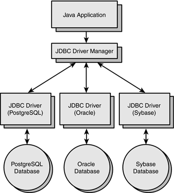

# SOLID

이전에 [OOP](./oop.md)에 대해서 공부하였다.
그렇다면 이러한 OOP의 특성을 잘 살려서 프로그래밍 할려면 어떻게 해야할까?

객체 지향을 공부한다면, 객체 지향으로 향 후 프로그래밍 할려면 굉장히 중요한 개념이 SOLID에 대해서 알아보자.

면접관이 질문을 한다.
```
객체지향이 뭔가?
```
나는 대답한다.
```
캡슐화, 상속, 추상화, 다형성 이다.
```

하지만 이것만 가지고 내가 객체지향을 완전히 이해했을까?? SOLID의 특성을 살려서 코딩을 하는것이야 말로 객체지향을 이해한다고 생각한다.

## 객체 지향의 설계 5대 원칙

* SRP (Single Responsibility Principle) 단일 책임 원칙
* OCP (Open Closed Principle) 개방 폐쇄 원칙
* LSP (Liskov Substitution Principle) 리스코프 치환 원칙
* ISP (Interface Segregation Principle) 인터페이스 분리 원칙
* DIP (Dependency Inversion Principle) 의존 역전 원칙
  
### SRP
*클래스의 역할과 책임을 최대한 하나로 하자.*
클래스를 선언할 때 작은 단위로 선언할 수록 SRP가 잘 지켜진다. 예를 들어서 병원이라는 클래스 안에서 환자를 관리하는 메소드가 있으면 어떻게 되겠는가? 수정이 있을 경우 병원자체의 클래스를 고쳐야한다.
하지만 환자라는 클래스를 따로만들어서 관리한다면 불필요하게 병원 클래스를 다루지 않아도 된다.

### OCP
*클래스,모듈,함수 등은 확장에 대해서는 열려 있어야 하지만 변경에 대해서는 닫혀 있어야한다.*

확장성 있게 설계하기위해서 특정 프로그램이 사용하는 함수들을 interface로 추상화시키고 클래스를 추가할 수 있도록 설계 하는 것이다. 아래처럼 JDBC Driver Manager라는 Interface를 통해서 Java Application은 실행된다. 만약 새로운 DataBase가 나오게 된다면 Interface를 이용해서 재 정의만 해주면 된다. 또한 MySql의 함수가 변경되면은 그 영역의 함수만 변경 하면 된다.


### LSP
*하위 클래스의 인스턴스는 상위형 객체 참조 변수에 대입해 상위 클래스의 인스턴스 역할을 하는데 문제가 없어야 한다.*

 LSP(리스코프 치환 원칙)은 하위클래스가 상위클래스 역할을 대신할 때 논리적으로 맞아 떨어져야 한다.
 즉 상속은 -> 확장의 개념이다. 비슷한 개념이 아니라 상위의 정보를 포함하고 있어야만 비로서 확장의 개념이다. 아버지와 아들은 LSP 위배 , 포유류와 고래는 LSP 가 적용

### ISP
*상황과 관련 있는 메서드만 제공해라.*
```
Interface를 정의할 때는 사용할 함수들만 정의해라는 소리. 막연하게 사용하지 않는 것 까지 정의하다보면 복잡해진다.
```
### DIP
*자신보다 변하기 쉬운 것에 의존하지 마라.*

한 가지 알아 둘 것은 상위로 갈 수록 더 추상적이고 변화에 민감하지 않고 수정 가능성이 낮아진다는 사실도 알아두면 좋다.

근데 여기서 잠깐!! 굉장히 비슷 비슷한 설계 구조다 바로 OCP(개방 폐쇄 원칙)을 설명할 때 나온 방법이다. 결국 하나의 설계 원칙 안에 다른 설계 원칙이 녹아져 있는 경우가 많다. 
