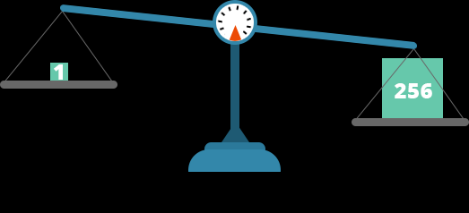
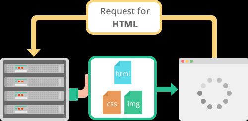
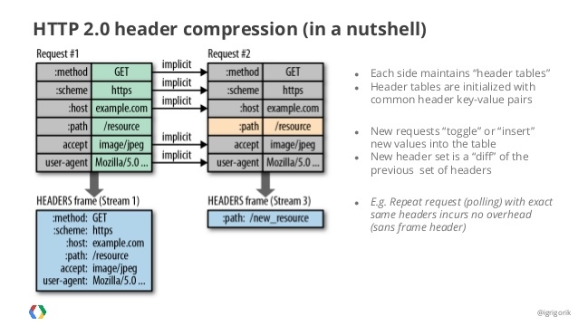
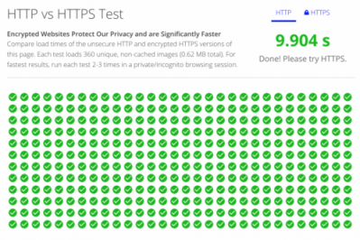

# HTTP1.1 과 HTTP2.0
  
*자그마치 15년여의 시간을 웹 통신 프로토콜의 절대권좌의 자리에 올라 꿋꿋이 버텨오신 당신의 똥고집에 세삼 존경심 마져 듭니다. 하지만 이제 그 자리를 내려 놓으셔야 겠습니다. 드디어 우리에겐 당신의 불편함과 느림을 대체할 새로운 분이 찾아 오셨거든요~*

## Flow


위 그림을 보면 감이 오는가?? HTTP 플로우가 동기식에서 보던 패턴이다.. 
즉 특정 요청을 보낸 다음에는 다른 일을 할 수가 없고 계속 기다려야한다!
반면에 HTTP 2.0 보전부터는 요청도 비동기식으로 보내고 받는것도 무엇이 먼저오듯 상관없다.
HTTP 1.1 에서는 저러한 문제를 해결하기 위해서 Pipelining 기법을 이용해서 개발하려고 했지만.
하나의 TCP 연결에서 3개의 이미지 (a.png, b.png, c.png)를 요청한다면 HTTP의 요청순서는 다음 그림과 같다.

```
| --- a.png --- |

                   | --- b.png --- |

                                      | --- c.png --- |
```
 

음.. 이러면 뭐가 문제냐??? 그렇겠지만 첫번째 요청이 길어진다면

```
| ------------------------------- a.png --------------- --- |
                                                             | -b.png- |

                                                                        | --c.png-- |
```

이러한 현상을 <strong>HOL (Head Of Line) Blocking</strong> - 특정 응답의 지연 이라고한다.

<br>

## RTT( Round Trip Time ) 증가

앞서 말한것처럼 http/1.1의 경우 일반적으로 하나의 connection에 하나의 요청을 처리 한다. 이렇다 보니 매 요청별로 connection을 만들게 되고 TCP상에서 동작하는 HTTP의 특성상 3-way Handshake 가 반복적으로 일어나고 또한 불필요한 RTT증가와 네트워크 지연을 초래하여 성능을 저하 시키게 된다.

## 무거운 Header 구조 (특히 Cookie)

http/1.1의 헤더에는 많은 메타정보들이 저장되어져 있다. 사용자가 방문한 웹페이지는 다수의 http요청이 발생하게 되는데 이 경우 매 요청시 마다 중복된 헤더값을 전송하게 되며(별도의 domain sharding을 하지 않았을 경우) 또한 해당 domain에 설정된 cookie정보도 매 요청시 마다 헤더에 포함되어 전송되며 어쩔땐 요청을 통해서 전송하려는 값보다 헤더 값이 더 큰경우도 비일비재 하다.(심지어 User-Agent 정보 하나만 해도 대략 120Byte가 넘는다. ㅜㅜ )

즉 배보다 배꼽이 더 큰 경우도 많다는 것이다.
이러한 HTTP 1.1 의 쓰레기같은 기능을 개선하기위해서 많은 개발자들이 여러 기법들을 생각해낸다.
Image Spriting
이미지를 한번에 불러와서 좌표값을 이용해 필요한 이미지를 가져온다거나....
Domain Sharding 이라고 해서 다수의 Connection을 생성해서 병렬로 요청을 보내거나..
이외에도 Minify CSS/Javascript, Data URI Scheme, Load Faster 별의별 기법을 써서 HTTP/1.1 의 성능을 개선시키려는 노력을 한다..
그중 시도에서 HTTP/1.1 을 기반으로 구글에서 성능향상시킨 SPIDY를 보여주고 이것이 현재의 HTTP/2 의 모델이 된다.


# HTTP 2.0

<strong>서빙은 한번에 !</strong>
## Multiplexed Streams

한 커넥션으로 동시에 여러개의 메세지를 주고 받을 있으며, 응답은 순서에 상관없이 stream으로 주고 받는다. HTTP/1.1의 Connection Keep-Alive, Pipelining의 개선이라 보면 된다.

## Stream Prioritization

예를 들면 클라이언트가 요청한 HTML문서안에 CSS파일 1개와 Image파일 2개가 존재하고 이를 클라이언트가 각각 요청하고 난 후 Image파일보다 CSS파일의 수신이 늦어지는 경우 브라우저의 렌더링이 늦어지는 문제가 발생하는데 HTTP/2의 경우 리소스간 의존관계(우선순위)를 설정하여 이런 문제를 해결하고 있다.




## Server Push

서버는 클라이언트의 요청에 대해 요청하지도 않은 리소스를 마음대로 보내줄 수 도 있다.

무슨 소리인고 하면 클라이언트(브라우저)가 HTML문서를 요청했고 해당 HTML에 여러개의 리소스(CSS, Image...) 가 포함되어 있는경우 HTTP/1.1에서 클라이언트는 요청한 HTML문서를 수신한 후 HTML문서를 해석하면서 필요한 리소스를 재 요청하는 반면 HTTP/2에선 Server Push기법을 통해서 클라이언트가 요청하지도 않은 (HTML문서에 포함된 리소스) 리소스를 Push 해주는 방법으로 클라이언트의 요청을 최소화 해서 성능 향상을 이끌어 낸다. 이를 PUSH_PROMISE 라고 부르며 PUSH_PROMISE를 통해서 서버가 전송한 리소스에 대해선 클라이언트는 요청을 하지 않는다.



## Header Compression

HTTP/2는 Header 정보를 압축하기 위해 Header Table과 Huffman Encoding 기법을 사용하여 처리하는데 이를 HPACK 압축방식이라 부르며 별도의 **명세서(RFC 7531)**로 관리하고 있다.



출처 : Google 검색

위 그림처럼 클라이언트가 두번의 요청을 보낸다고 가정하면 HTTP/1.x의 경우 두개의 요청 Header에 중복값이 존재해도 그냥 중복 전송한다. 하지만 HTTP/2에선 Header에 중복값이 존재하는 경우 Static/Dynamic Header Table 개념을 사용하여 중복 Header를 검출하고 중복된 Header는 index값만 전송하고 중복되지 않은 Header정보의 값은 Huffman Encoding 기법으로 인코딩 처리 하여 전송한다.


## HTTP/1.1 과 HTTP/2 성능비교
