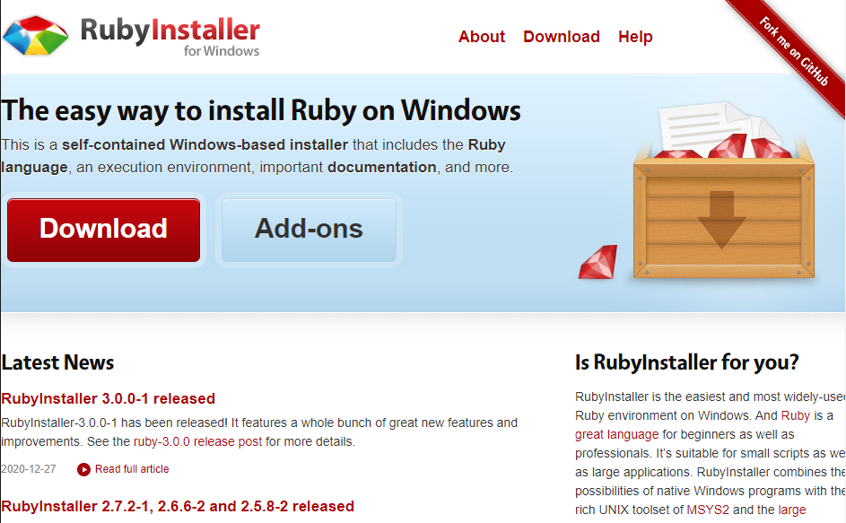
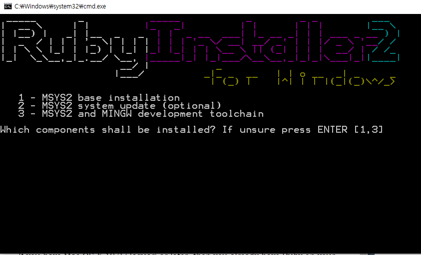

# 시작하기

## window 버전
[download 하로가기.](https://www.ruby-lang.org/en/downloads/)

</img> 

Download 사이트로 접속해서 본인에게 맞는 버전을 다운로드 한다.
(튜토리얼에서는 3.0 버전으로 진행하기 때문에 3.0버전으로 진행)

</img> 

1 번을 눌려서 다운로드를 진행합니다.