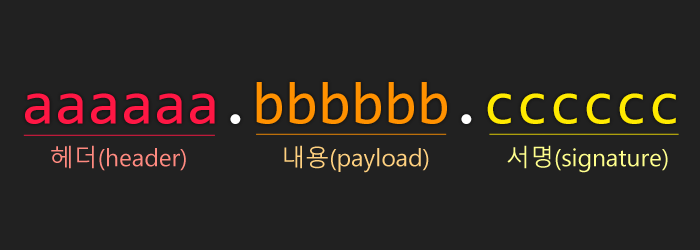

# JWT 토큰
- JSON Web Token(JWT)은 웹표준(RFC7519)으로서 두 개체에서 JSON 객체를 사용하여 가볍고 자가수용적인 (self-contained)방식으로 정보를 안전성 있게 전달해줍니다.

# JWT는 어떤 상황에서 사용될까?
- 다음과 같은 상황에서 JWT 가 유용하게 사용 될 수 있습니다.
- 회원 인증, 정보교류



## 헤더(Header)
- Header는 두가지의 정보를 지니고 있습니다.
- typ : 토큰의 타입을 지정합니다. 바로 JWT 이죠.
- alg : 해싱 알고리즘을 지정합니다. 해싱 알고리즘으로는 보통 HMAC SHA256 혹은 RSA 가 사용되며, 이 알고리즘은, 토큰을 검증 할 때 사용된는 signature 부분에서 사용됩니다.

```
{
  "typ": "JWT",
  "alg": "HS256"
}
```

## 정보(payload)
payload 부분에는 토큰에 담을 정보가 들어있습니다. 여기에 담는 정보의 한'조각'을 클레임(claim) 이라고 부르고, 이는 name value의 한쌍으로 이뤄져있습니다. 토큰에는 여러개의 클레임 들을 넣을 수 있습니다.


## 서명(signature)
JSON Web Token의 마지막 부분은 바로 서명(signature) 입니다. 이 서명은 헤더의 인코딩값과, 정보의 인코딩값을 합친 주어진 비밀키로 해쉬를 하여 생성합니다.

이런 정보들을 조합하여 <mark>.</mark>을 넣어 합해줍니다.
```
eyJ0eXAiOiJKV1QiLCJhbGciOiJIUzI1NiJ9.eyJpc3MiOiJ2ZWxvcGVydC5jb20iLCJleHAiOiIxNDg1MjcwMDAwMDAwIiwiaHR0cHM6Ly92ZWxvcGVydC5jb20vand0X2NsYWltcy9pc19hZG1pbiI6dHJ1ZSwidXNlcklkIjoiMTEwMjgzNzM3MjcxMDIiLCJ1c2VybmFtZSI6InZlbG9wZXJ0In0
```
이 값을 비밀키의 값을 secret 으로 해싱을 하고 base64로 인코딩하면 다음과 같은 값이 나옵니다.
