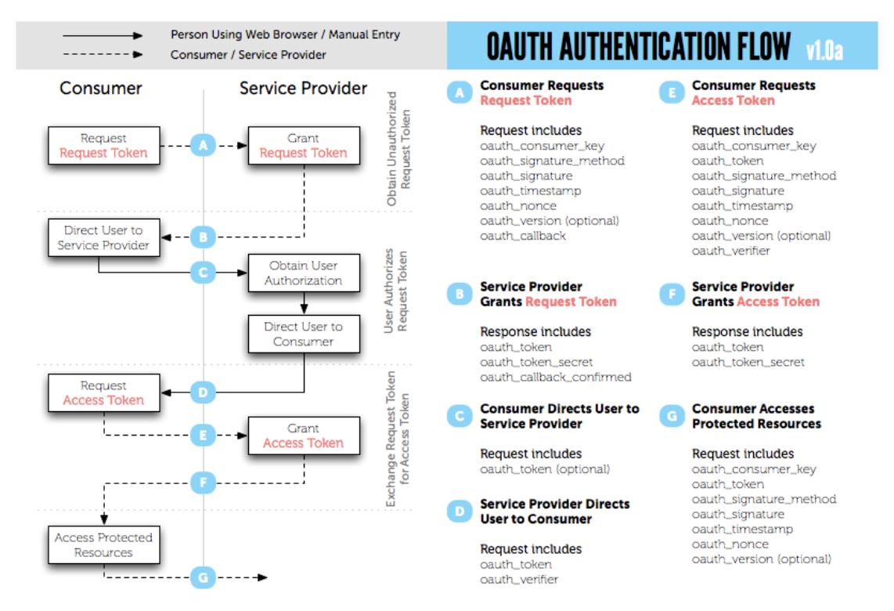
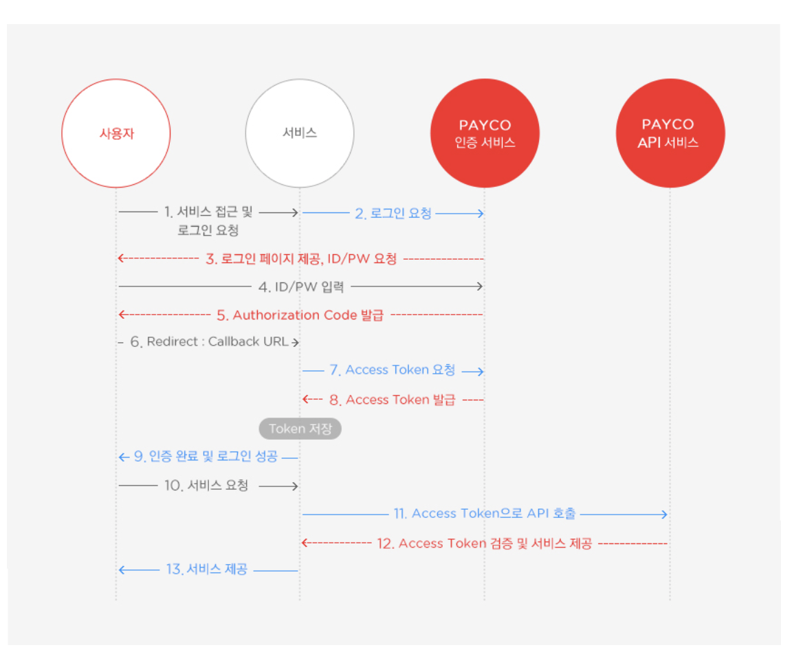

# 생각해보기

웹 사이트를 이용할 때 "네이버로 로그인" 같이 별도의 회원가입 없이 로그인을 제공하는 서비스를 이용해 본적이 있다. 이때 해당 플랫폼의 아이디가 있다면 외부 서비스에서도 인증을 가능하게하고 그 서비스의 API를 사용할. 수 있다. 이것을 OAuth라고 한다.

# 이러한 Oauth가 왜 생겼을까?
제 3자의 웹서버에 아이디와 비밀번호를 제공하고 싶지 않은 요구가 첫번째 이고 개인정보를 여러곳에 노출시키면 피싱에 둔감해집니다. 무엇보다도 Application이 안전하다는 보장이 없기 때문입니다.

# 두번째로는 비밀번호의 인증방식의 문제를
- 신뢰: 사용자가 애플리케이션에 ID/PW를 제공하기 꺼려함
- 피싱에 둔감해짐: 각 종 애플리케이션들에 ID/PW 를 계속 제공하는 경우
- 접근범위가 늘어남에 따른 위험 부담: ID/PW를 모두 알고 있는 애플리케이션은 모든 권한을 가짐
- 신뢰성의 제한: PW 를 변경한다면 애플리케이션은 동작을 하지 못하게 됨
- 폐기문제: 권한을 폐기할 수 있는 유일한 방법이 PW를 변경하는 것

# 용어정리
- User : Service Provider에 계정을 가지고 있으면서, Consumer를 이용하려는 사용자
- Service Provider : OAuth를 사용하는 Open API를 제공하는 서비스
- Consumer : OAuth 인증을 사용해 Service Provider의 기능을 사용하려는 애플리케이션이나 웹 서비스
- Request Token : Consumer가 Service Provider에게 접근 권한을 인증받기 위해 사용하는 값 인증이 완료된 후에는 Access Token으로 교환한다.
- Access Toekn : 인증 후 Consumer가 Service Provider의 자원에 접근하기 위한 키를 포함한 값

# Request Token의 용도
Consumer 가 Service Provider에게 Access Token을 받기이전에 받아도 될까요?? 라고 요청하는 과정이다.

but... OAuth1.0의 문제점들이 보인다

일단 web이 아닌 어플리케이션에서의 지원이 부족하다. 또한 HMAC을 통해 암호화를 하는 번거로운 과정을 겪습니다. 또한 인증토큰이 만료가 되지 않는 단점이 있다.

# Oauth 2.0

달라진 점
- 기능의 단순화, 기능의 규모의 확장성 등을 지원하기 위해 만들어 졌다.
- 1.0은 만들어진 다음 표준이 된 반면 2.0은 처음부터 표준 프로세스
- https가 필수여서 간단해 졌다.(암호화는 https가 담당)
- 다양한 인증방식을 지원한다.
- api서버에서 인증서버를 분리 할 수 있도록 해놓았다.

네이버 로그인을 예로 들자면
Client는 네이버 플랫폼을 사용하겠다는 ID 값과 Secret값을 발급 받는다.
Resource owner(나)가 Client에서 네이버 로그인을 사용한다면 Client는 Resource Server(네이버)로 접속하게되고 로그인을 진행한다. 로그인이 완료가된다면 Resource Server(네이버)에서는 Code(Request Token)을 Client에게 전달해준다. 그러면 여기서 다시!! Client 에서는 ID, Secret , Code 세가지를 Resource Server 로 보내게되고 네이버는 인증이 완료되어 Access Token을 발급받는다. (이것을 개인 DB에 저장하거나해서 사용한다)

# Oauth 2.0 인증 종류
* Authorization Code Grant
* Implicit Grant
* Resource Owner Password Credentials Grant
* Client Credentials Grant
