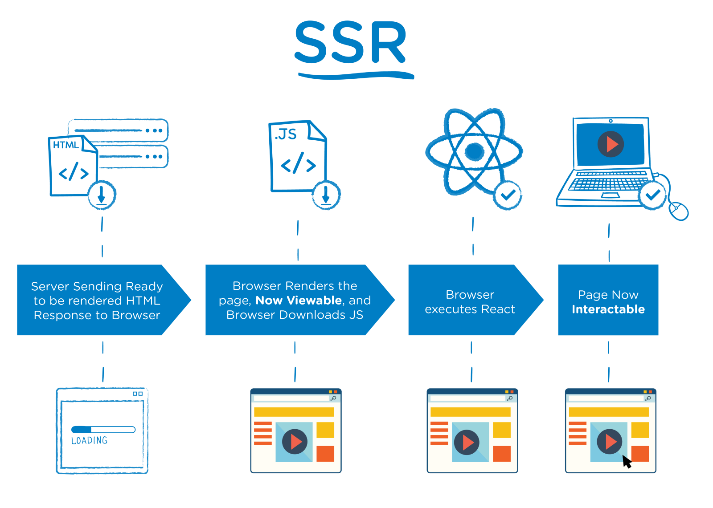
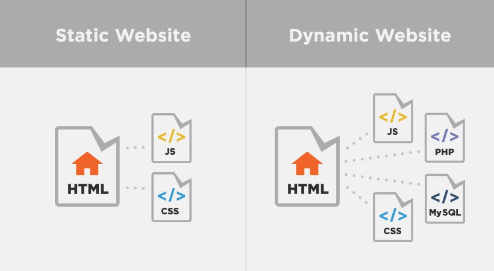

# 렌더링변화과정
렌더링은 인터넷이 만들어지는 시대에서부터 지금까지 여러 변화를 거치면서 지금의 웹 사이트 형태가 만들어졌습니다. 오늘은 웹 생태계가 어떠한 변화 과정을 바뀌어왔는지 알아보겠습니다.


## Static Sites
가장 기본적인 사이트 정적 사이트입니다. 정적 사이트란 어미 그대로 URI 요청시 HTML 문서자체를 브라우저에 주는 페이지입니다. 모든 페이지 메뉴들을 HTML하나로 만들어야하는 단점도 존재하지만 HTML,CSS,JavaScript, 이미지 등의 정적 파일만 CDN 등을 통해서 배포하면 별도의 서버를 운영할 필요도 없고 서버에 과부하도 동적페이지에 비해서 적습니다.
<mark>페이지내에서 다른 링크를 클릭하면 서버내에서 다른 Document 파일(html)을 가져와야한다.</mark>


## Iframe
이러한 정적페이지의 문제를 해결하고자 1996년에 Iframe이 등장합니다. Iframe은 문서내에서 다른 문서를 불러올수 있는 기술이고 지금도 네이버뉴스, 스포츠등과 같이 Iframe을 이용해서 내 페이지내에서 다른 페이지를 불러올수 있습니다.

## XMLHttpRequest
지금도 많이 사용하고있는 fetch API입니다. 서버에서 필요한 데이터만 가져오는 기술이고 동적으로 페이지를 업데이트하는 기술입니다.

## AJAX
XMLHttpRequest가 많이 사용하되면서 2005년 AJAX라는 이름으로 명명되고 Google Email, Google Map에서 사용하게된다. 이것이 오늘날의 <mark>SPA(Single Page Application)입니다.</mark>

## SPA
하드웨어의 사양이 증가하고 소프트웨어의 품질이 좋아지면서 웹 사이트에서도 여러 요청들을 무리없이 해낼 수 있게 되었습니다.
JavaScript도 표준화되면서 React,앵귤러같은 프론트엔드 개발 프레임워크가 발전하였습니다. SPA를 할 수 있는 <mark>CSR(Client Side Rendering)이 나오게되었습니다</mark>


## CSR(Client Side Rendering)
클라이언트 사이드 렌더링이랑 클라이언트(브라우저) 상에서 동적페이지들을 컨트롤 하겠다는 의미입니다. 서버에서 index.html이라는 파일을 클라이언트에게 보내주면
```
<!DOCTYPE html>
<html lang="en">
<head>
    <meta charset="UTF-8">
    <meta name="description" content="Redbin Web site">
    <title>Redbin App</title>
</head>
<body>
    <div id="root"></div>
    <script src="app.js"></script>
</body>
</html>
```
위와 같은 소스파일을 가져옵니다. 그래서 HTML 비어져있기 때문에 처음에 접속하면 빈화면만 있게되고 그다음 js파일을 다운로드하게됩니다. app.js에는 어플리케이션에 필요한 로직과 어플리케이션을 구동하는 프레임워크의 소스코드까지 다운로드합니다. 그렇기 때문에 많은 시간이 걸리게됩니다. 필요한 페이지가 있다면 js파일에 있는 소스들이 서버에 필요한 데이터들을 호출하게됩니다.
<mark> 단점으로는 SEO(Search Engine Optimization)이 있습니다. 검색엔진의 최적화가 어렵습니다. 이유는 텅텅비어져있으니깐... (지금도 해결이 안되고 있습니다.) </mark>

## SSR(Server Side Renderring)
클라이언트 사이드는 빈 HTML파일만 있는게 문제였다. 이러한 문제를 해결하기위해서 과거의 static 사이트처럼 서버에서 필요한 데이터와 HTML구조들을 만들어서 클라이언트 사이드에게 전송하게 합니다. (동적으로 조금 제어할 수 있는 소스코드와 함께) SSR을 이용하게되면 첫 번째 페이지 로딩이 빨라지고 효율적인 SEO를 사용할 수 있습니다. (하지만 블링크 이슈,서버의 과부하가 걸리기 쉽고, TTV TTI의 이슈가 존재합니다.)
<mark>인덱스파일을 받아왔지만 js파일은 가져오지않아 클릭이 안되는 이슈가 존재합니다.</mark>

## SSG(Static Site Generation)
- React + Gatsby를 이용한 솔루션
- 정적인 요소와 동적인 요소를 이용할 수 있습니다

## SSR(Server Side Rendergin)
- React + Next를 이용한 솔루션

## 추가중
