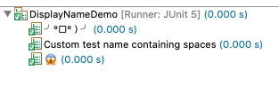
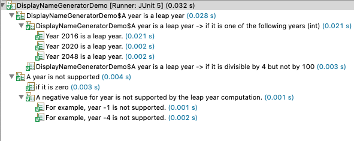

# Junit 5 Eaxample

이 내용은 공식문서 https://junit.org/junit5/docs/current/user-guide/ 를 참고 하였습니다.
<br>
많은 내용은 다루지 않고 몇가지 기능만 다루어 보려고 합니다.
<br>
Junit5가 나온지는 꽤 되었지만 사용하고 있는 기능만 사용하고 새로운 기능들은 잘 모르는 상태였습니다.
<br>
인턴생활을 하면서 시간이 널널하기에 새로운 버전에 대해서 공부해볼려고 합니다.

# Junit 5 란?
Junit의 이전 버전과 달리 Junit 5는 세가지 하위 프로젝트의 여러 모듈로 구성됩니다.

<mark>JUnit 5 = JUnit Platform + JUnit Jupiter + JUnit Vintage</mark>

## junit 플랫폼
- 테스트 프레임워크 실행은 JVM에서 동작합니다.

## Junit Jupiter
- Junit 5에서 테스트를 하기위한 프로그래밍 모델 과 익스텐션 모델의 조합입니다.
- Jupiter 하위 프로젝트는 TestEngine 플랫폼에서 Jupiter 기반 테스트를 제공합니다.

## Junit Vintage 
- Junit 3  및 Junit 4 기반 테스트를 시행합니다.


## 지원 되는 Java
- java 8 이상

# Junit Jupiter 
```
		<dependency>
			<groupId>org.junit.jupiter</groupId>
			<artifactId>junit-jupiter</artifactId>
			<scope>test</scope>
		</dependency>
```

다음 예제를 가지고 테스트 하겠습니다.

### Caclculator.java
```
package com.example.junit5.project;

public class Calculator {

	public int add(int a, int b) {
		return a + b;
	}
}

```

### 첫 번째 테스트
```
package com.example.junit5.project;

import static org.junit.jupiter.api.Assertions.*;

import org.junit.jupiter.api.Test;

class MyFirstJUnitJupiterTests {
	
	private final Calculator calculator = new Calculator();
	
	@Test
	void test() {
		assertEquals(2, calculator.add(1, 1));
	}

}
```


# 어노테이션
<table style="border-collapse: collapse; width: 101.744%; height: 2098px;" border="1" data-ke-style="style4"><tbody><tr style="height: 126px;"><td style="height: 126px; width: 19.2712%;"><p>@Test</p></td><td style="height: 126px; width: 80.7288%;"><p>메서드가 테스트 메서드임을 나타냅니다.<span>&nbsp;</span>JUnit 4의<span>&nbsp;</span>@Test어노테이션<span>&nbsp;</span>과 달리이<span>&nbsp;</span>어노테이션은 JUnit Jupiter의 테스트 확장이 자체 전용 어노테이션을 기반으로 작동하기 때문에 속성을 선언하지 않습니다.<span>&nbsp;</span>이러한 메서드는<span>&nbsp;</span>재정의<span>&nbsp;</span>되지 않는 한<span>&nbsp;</span>상속<span>&nbsp;</span>됩니다<span>&nbsp;</span>.</p></td></tr><tr style="height: 78px;"><td style="height: 78px; width: 19.2712%;"><p>@ParameterizedTest</p></td><td style="height: 78px; width: 80.7288%;"><p>메서드가<span>&nbsp;</span>매개 변수<span>&nbsp;</span>가있는<span>&nbsp;</span>테스트<span>&nbsp;</span>임을 나타냅니다<span>&nbsp;</span>.<span>&nbsp;</span>이러한 메서드는<span>&nbsp;</span>재정의<span>&nbsp;</span>되지 않는 한<span>&nbsp;</span>상속<span>&nbsp;</span>됩니다<span>&nbsp;</span>.</p></td></tr><tr style="height: 78px;"><td style="height: 78px; width: 19.2712%;"><p>@RepeatedTest</p></td><td style="height: 78px; width: 80.7288%;"><p>메서드가<span>&nbsp;</span>반복 테스트를<span>&nbsp;</span>위한 테스트 템플릿임을 나타냅니다<span>&nbsp;</span>.<span>&nbsp;</span>이러한 메서드는<span>&nbsp;</span>재정의<span>&nbsp;</span>되지 않는 한<span>&nbsp;</span>상속<span>&nbsp;</span>됩니다<span>&nbsp;</span>.</p></td></tr><tr style="height: 78px;"><td style="height: 78px; width: 19.2712%;"><p>@TestFactory</p></td><td style="height: 78px; width: 80.7288%;"><p>메서드가<span>&nbsp;</span>동적 테스트를<span>&nbsp;</span>위한 테스트 팩토리임을 나타냅니다<span>&nbsp;</span>.<span>&nbsp;</span>이러한 메서드는<span>&nbsp;</span>재정의<span>&nbsp;</span>되지 않는 한<span>&nbsp;</span>상속<span>&nbsp;</span>됩니다<span>&nbsp;</span>.</p></td></tr><tr style="height: 102px;"><td style="height: 102px; width: 19.2712%;"><p>@TestTemplate</p></td><td style="height: 102px; width: 80.7288%;"><p>메서드가<span>&nbsp;</span>등록 된<span>&nbsp;</span>공급자가<span>&nbsp;</span>반환 한 호출 컨텍스트 수에 따라 여러 번 호출되도록 설계된<span>&nbsp;</span>테스트 케이스<span>&nbsp;</span>의<span>&nbsp;</span>템플릿<span>&nbsp;</span>임을 나타냅니다<span>&nbsp;</span>.<span>&nbsp;</span>이러한 메서드는<span>&nbsp;</span>재정의<span>&nbsp;</span>되지 않는 한<span>&nbsp;</span>상속<span>&nbsp;</span>됩니다<span>&nbsp;</span>.</p></td></tr><tr style="height: 102px;"><td style="height: 102px; width: 19.2712%;"><p>@TestMethodOrder</p></td><td style="height: 102px; width: 80.7288%;"><p>주석이 달린 테스트 클래스에 대한<span>&nbsp;</span>테스트 메서드 실행 순서<span>&nbsp;</span>를 구성하는 데 사용됩니다<span>&nbsp;</span>.<span>&nbsp;</span>JUnit 4의<span>&nbsp;</span>@FixMethodOrder.<span>&nbsp;</span>이러한 주석은<span>&nbsp;</span>상속<span>&nbsp;</span>됩니다.</p></td></tr><tr style="height: 78px;"><td style="height: 78px; width: 19.2712%;"><p>@TestInstance</p></td><td style="height: 78px; width: 80.7288%;"><p>주석이 달린 테스트 클래스에 대한<span>&nbsp;</span>테스트 인스턴스 수명주기<span>&nbsp;</span>를 구성하는 데 사용됩니다<span>&nbsp;</span>.<span>&nbsp;</span>이러한 주석은<span>&nbsp;</span>상속<span>&nbsp;</span>됩니다.</p></td></tr><tr style="height: 78px;"><td style="height: 78px; width: 19.2712%;"><p>@DisplayName</p></td><td style="height: 78px; width: 80.7288%;"><p>테스트 클래스 또는 테스트 메서드에 대한<span>&nbsp;</span>사용자 지정<span>&nbsp;</span>표시 이름<span>&nbsp;</span>을<span>&nbsp;</span>선언합니다<span>&nbsp;</span>.<span>&nbsp;</span>이러한 주석은<span>&nbsp;</span>상속<span>&nbsp;</span>되지 않습니다<span>&nbsp;</span>.</p></td></tr><tr style="height: 78px;"><td style="height: 78px; width: 19.2712%;"><p>@DisplayNameGeneration</p></td><td style="height: 78px; width: 80.7288%;"><p>테스트 클래스에 대한<span>&nbsp;</span>사용자 지정<span>&nbsp;</span>표시 이름 생성기<span>&nbsp;</span>를<span>&nbsp;</span>선언합니다<span>&nbsp;</span>.<span>&nbsp;</span>이러한 주석은<span>&nbsp;</span>상속<span>&nbsp;</span>됩니다.</p></td></tr><tr style="height: 126px;"><td style="height: 126px; width: 19.2712%;"><p>@BeforeEach</p></td><td style="height: 126px; width: 80.7288%;"><p>의미 주석 메소드가 실행되어야 함<span>&nbsp;</span>전에<span>&nbsp;</span><b>각각</b><span>&nbsp;</span>@Test<span>&nbsp;</span>,<span>&nbsp;</span>@RepeatedTest,<span>&nbsp;</span>@ParameterizedTest, 또는<span>&nbsp;</span>@TestFactory현재의 메소드;<span>&nbsp;</span>JUnit 4의<span>&nbsp;</span>@Before.<span>&nbsp;</span>이러한 메서드는<span>&nbsp;</span>재정의<span>&nbsp;</span>되지 않는 한<span>&nbsp;</span>상속<span>&nbsp;</span>됩니다<span>&nbsp;</span>.</p></td></tr><tr style="height: 126px;"><td style="height: 126px; width: 19.2712%;"><p>@AfterEach</p></td><td style="height: 126px; width: 80.7288%;"><p>의미 주석 메소드가 실행되어야 함<span>&nbsp;</span>후에<span>&nbsp;</span><b>각각</b><span>&nbsp;</span>@Test<span>&nbsp;</span>,<span>&nbsp;</span>@RepeatedTest,<span>&nbsp;</span>@ParameterizedTest, 또는<span>&nbsp;</span>@TestFactory현재의 메소드;<span>&nbsp;</span>JUnit 4의<span>&nbsp;</span>@After.<span>&nbsp;</span>이러한 메서드는<span>&nbsp;</span>재정의<span>&nbsp;</span>되지 않는 한<span>&nbsp;</span>상속<span>&nbsp;</span>됩니다<span>&nbsp;</span>.</p></td></tr><tr style="height: 174px;"><td style="height: 174px; width: 19.2712%;"><p>@BeforeAll</p></td><td style="height: 174px; width: 80.7288%;"><p>주석 메소드가 실행되어야 함을 나타내고<span>&nbsp;</span>전에<span>&nbsp;</span><b>모든</b><span>&nbsp;</span>@Test<span>&nbsp;</span>,<span>&nbsp;</span>@RepeatedTest,<span>&nbsp;</span>@ParameterizedTest및<span>&nbsp;</span>@TestFactory현재 클래스의 메소드;<span>&nbsp;</span>JUnit 4의<span>&nbsp;</span>@BeforeClass.<span>&nbsp;</span>이러한 메서드는<span>&nbsp;</span>상속되고<span>&nbsp;</span>(<span>&nbsp;</span>숨겨<span>&nbsp;</span>지거나<span>&nbsp;</span>재정의<span>&nbsp;</span>되지 않는 한<span>&nbsp;</span>) 반드시<span>&nbsp;</span>상속<span>&nbsp;</span>되어야합니다<span>&nbsp;</span>static( "클래스 별"<span>&nbsp;</span>테스트 인스턴스 수명주기<span>&nbsp;</span>가 사용<span>&nbsp;</span>되지 않는 경우<span>&nbsp;</span>).</p></td></tr><tr style="height: 174px;"><td style="height: 174px; width: 19.2712%;"><p>@AfterAll</p></td><td style="height: 174px; width: 80.7288%;"><p>주석 메소드가 실행되어야 함을 나타내고,<span>&nbsp;</span>이후<span>&nbsp;</span><b>모든</b><span>&nbsp;</span>@Test<span>&nbsp;</span>,<span>&nbsp;</span>@RepeatedTest,<span>&nbsp;</span>@ParameterizedTest및<span>&nbsp;</span>@TestFactory현재 클래스의 메소드;<span>&nbsp;</span>JUnit 4의<span>&nbsp;</span>@AfterClass.<span>&nbsp;</span>이러한 메서드는<span>&nbsp;</span>상속되고<span>&nbsp;</span>(<span>&nbsp;</span>숨겨<span>&nbsp;</span>지거나<span>&nbsp;</span>재정의<span>&nbsp;</span>되지 않는 한<span>&nbsp;</span>) 반드시<span>&nbsp;</span>상속<span>&nbsp;</span>되어야합니다<span>&nbsp;</span>static( "클래스 별"<span>&nbsp;</span>테스트 인스턴스 수명주기<span>&nbsp;</span>가 사용<span>&nbsp;</span>되지 않는 경우<span>&nbsp;</span>).</p></td></tr><tr style="height: 126px;"><td style="height: 126px; width: 19.2712%;"><p>@Nested</p></td><td style="height: 126px; width: 80.7288%;"><p>주석이 달린 클래스가 정적이 아닌<span>&nbsp;</span>중첩 테스트 클래스<span>&nbsp;</span>임을 나타냅니다<span>&nbsp;</span>.<span>&nbsp;</span>@BeforeAll및<span>&nbsp;</span>@AfterAll방법은 직접 사용할 수 없습니다<span>&nbsp;</span>@Nested은 "당 클래스"를 제외 테스트 클래스<span>&nbsp;</span>테스트 인스턴스 라이프 사이클이<span>&nbsp;</span>사용됩니다.<span>&nbsp;</span>이러한 주석은<span>&nbsp;</span>상속<span>&nbsp;</span>되지 않습니다<span>&nbsp;</span>.</p></td></tr><tr style="height: 126px;"><td style="height: 126px; width: 19.2712%;"><p>@Tag</p></td><td style="height: 126px; width: 80.7288%;"><p>클래스 또는 메서드 수준에서<span>&nbsp;</span>테스트 필터링을위한 태그<span>&nbsp;</span>를 선언하는 데 사용됩니다<span>&nbsp;</span>.<span>&nbsp;</span>TestNG의 테스트 그룹 또는 JUnit 4의 Categories와 유사합니다. 이러한 주석은<span>&nbsp;</span>클래스 수준에서<span>&nbsp;</span>상속<span>&nbsp;</span>되지만 메서드 수준<span>&nbsp;</span>에서는<span>&nbsp;</span>상속<span>&nbsp;</span>되지 않습니다.</p></td></tr><tr style="height: 78px;"><td style="height: 78px; width: 19.2712%;"><p>@Disabled</p></td><td style="height: 78px; width: 80.7288%;"><p>테스트 클래스 또는 테스트 메서드<span>&nbsp;</span>를<span>&nbsp;</span>비활성화<span>&nbsp;</span>하는<span>&nbsp;</span>데 사용됩니다<span>&nbsp;</span>.<span>&nbsp;</span>JUnit 4의<span>&nbsp;</span>@Ignore.<span>&nbsp;</span>이러한 주석은<span>&nbsp;</span>상속<span>&nbsp;</span>되지 않습니다<span>&nbsp;</span>.</p></td></tr><tr style="height: 102px;"><td style="height: 102px; width: 19.2712%;"><p>@Timeout</p></td><td style="height: 102px; width: 80.7288%;"><p>실행이 주어진 기간을 초과하는 경우 테스트, 테스트 팩토리, 테스트 템플릿 또는 수명주기 메서드를 실패하는 데 사용됩니다.<span>&nbsp;</span>이러한 주석은<span>&nbsp;</span>상속<span>&nbsp;</span>됩니다.</p></td></tr><tr style="height: 78px;"><td style="height: 78px; width: 19.2712%;"><p>@ExtendWith</p></td><td style="height: 78px; width: 80.7288%;"><p>확장을 선언적<span>&nbsp;</span>으로<span>&nbsp;</span>등록하는<span>&nbsp;</span>데 사용됩니다<span>&nbsp;</span>.<span>&nbsp;</span>이러한 주석은<span>&nbsp;</span>상속<span>&nbsp;</span>됩니다.</p></td></tr><tr style="height: 78px;"><td style="height: 78px; width: 19.2712%;"><p>@RegisterExtension</p></td><td style="height: 78px; width: 80.7288%;"><p>필드를 통해<span>&nbsp;</span>프로그래밍 방식으로 확장<span>&nbsp;</span>을<span>&nbsp;</span>등록하는<span>&nbsp;</span>데 사용됩니다<span>&nbsp;</span>.<span>&nbsp;</span>이러한 필드는<span>&nbsp;</span>음영 처리<span>&nbsp;</span>되지 않는 한<span>&nbsp;</span>상속<span>&nbsp;</span>됩니다<span>&nbsp;</span>.</p></td></tr><tr style="height: 102px;"><td style="height: 102px; width: 19.2712%;"><p>@TempDir</p></td><td style="height: 102px; width: 80.7288%;"><p>라이프 사이클 방법 또는 테스트 방법에서 필드 주입 또는 매개 변수 주입을 통해<span>&nbsp;</span>임시 디렉토리<span>&nbsp;</span>를<span>&nbsp;</span>제공하는 데 사용됩니다<span>&nbsp;</span>.<span>&nbsp;</span>에있는<span>&nbsp;</span>org.junit.jupiter.api.io패키지.</p></td></tr></tbody></table>

# 어노테이션 커스톰
Junit Jupiter 주석은 메타 주석으로 사용할 수있습니다. (상속기능이 있습니다.)

어노테이션을 정의하고
```
    @Target(ElementType.METHOD)
    @Retention(RetentionPolicy.RUNTIME)
    @Tag("fast")
    @Test
    public @interface FastTest {
    }
```
다음곽 같이 사용할 수있습니다. @Tag("fast")를 붙여넣는 대신 사용할 수 있어 가독성이 올라간답니다..
```
	@FastTest	
	void test() {
		assertEquals(2, calculator.add(1, 1));
	}
```

# 생명주기

Junit5에는 다음과 같은 생명주기가 존재합니다.

```
package com.example.junit5.project;

import static org.junit.jupiter.api.Assertions.fail;
import static org.junit.jupiter.api.Assumptions.assumeTrue;

import org.junit.jupiter.api.AfterAll;
import org.junit.jupiter.api.AfterEach;
import org.junit.jupiter.api.BeforeAll;
import org.junit.jupiter.api.BeforeEach;
import org.junit.jupiter.api.Disabled;
import org.junit.jupiter.api.Test;

public class StandardTests {
	  @BeforeAll
	    static void initAll() {
	    }

	    @BeforeEach
	    void init() {
	    }

	    @Test
	    void succeedingTest() {
	    }

	    @Test
	    void failingTest() {
	        fail("a failing test");
	    }

	    @Test
	    @Disabled("for demonstration purposes")
	    void skippedTest() {
	        // not executed
	    }

	    @Test
	    void abortedTest() {
	        assumeTrue("abc".contains("Z"));
	        fail("test should have been aborted");
	    }

	    @AfterEach
	    void tearDown() {
	    }

	    @AfterAll
	    static void tearDownAll() {
	    }
}
```

# @DisplayNmae
다음 주석을 활용해서 테스터의 이름을 부여합니다.
```
package com.example.junit5.project;

import org.junit.jupiter.api.DisplayName;
import org.junit.jupiter.api.Test;

public class DisplayNameDemo {
    @Test
    @DisplayName("Custom test name containing spaces")
    void testWithDisplayNameContainingSpaces() {
    }

    @Test
    @DisplayName("╯°□°）╯")
    void testWithDisplayNameContainingSpecialCharacters() {
    }

    @Test
    @DisplayName("😱")
    void testWithDisplayNameContainingEmoji() {
    }
}

```


# @DisplayNameGeneration
주석을 통해서 사용자 지정으로 이름을 생성합니다.
<table style="border-collapse: collapse; width: 100%;" border="1"><tbody><tr><td><p>Standard</p></td><td><p>JUnit Jupiter 5.0이 출시 된 이후 표준 표시 이름 생성 동작과 일치합니다.</p></td></tr><tr><td><p>Simple</p></td><td><p>매개 변수가없는 메소드의 후행 괄호를 제거합니다.</p></td></tr><tr><td><p>ReplaceUnderscores</p></td><td><p>밑줄을 공백으로 바꿉니다.</p></td></tr><tr><td><p>IndicativeSentences</p></td><td><p>테스트 이름과 포함하는 클래스를 연결하여 완전한 문장을 생성합니다.</p></td></tr></tbody></table>

# IndicativeSentences
@IndicativeSentencesGeneration를 사용하여 사용자 지정이 가능합니다
```
package com.example.junit5.project;

import org.junit.jupiter.api.DisplayName;
import org.junit.jupiter.api.DisplayNameGeneration;
import org.junit.jupiter.api.DisplayNameGenerator;
import org.junit.jupiter.api.IndicativeSentencesGeneration;
import org.junit.jupiter.api.Nested;
import org.junit.jupiter.api.Test;
import org.junit.jupiter.params.ParameterizedTest;
import org.junit.jupiter.params.provider.ValueSource;

public class DisplayNameGeneratorDemo {
	@Nested
	@DisplayNameGeneration(DisplayNameGenerator.ReplaceUnderscores.class)
	class A_year_is_not_supported {

		@Test
		void if_it_is_zero() {
		}

		@DisplayName("A negative value for year is not supported by the leap year computation.")
		@ParameterizedTest(name = "For example, year {0} is not supported.")
		@ValueSource(ints = { -1, -4 })
		void if_it_is_negative(int year) {
		}

	}

	@Nested
	@IndicativeSentencesGeneration(separator = " -> ", generator = DisplayNameGenerator.ReplaceUnderscores.class)
	class A_year_is_a_leap_year {

		@Test
		void if_it_is_divisible_by_4_but_not_by_100() {
		}

		@ParameterizedTest(name = "Year {0} is a leap year.")
		@ValueSource(ints = { 2016, 2020, 2048 })
		void if_it_is_one_of_the_following_years(int year) {
		}

	}

}

```


# 운영 체제 조건
운영체제에 대한 테스트를 진행할 수 있습니다.
```
@Test
@EnabledOnOs(MAC)
void onlyOnMacOs() {
    // ...
}

@TestOnMac
void testOnMac() {
    // ...
}

@Test
@EnabledOnOs({ LINUX, MAC })
void onLinuxOrMac() {
    // ...
}

@Test
@DisabledOnOs(WINDOWS)
void notOnWindows() {
    // ...
}

@Target(ElementType.METHOD)
@Retention(RetentionPolicy.RUNTIME)
@Test
@EnabledOnOs(MAC)
@interface TestOnMac {
}
```

# 런타임 환경 조건
Jdk 버전에 따른 테스트를 진행 할 수있습니다.
```
@Test
@EnabledOnJre(JAVA_8)
void onlyOnJava8() {
    // ...
}

@Test
@EnabledOnJre({ JAVA_9, JAVA_10 })
void onJava9Or10() {
    // ...
}

@Test
@EnabledForJreRange(min = JAVA_9, max = JAVA_11)
void fromJava9to11() {
    // ...
}

@Test
@EnabledForJreRange(min = JAVA_9)
void fromJava9toCurrentJavaFeatureNumber() {
    // ...
}

@Test
@EnabledForJreRange(max = JAVA_11)
void fromJava8To11() {
    // ...
}

@Test
@DisabledOnJre(JAVA_9)
void notOnJava9() {
    // ...
}

@Test
@DisabledForJreRange(min = JAVA_9, max = JAVA_11)
void notFromJava9to11() {
    // ...
}

@Test
@DisabledForJreRange(min = JAVA_9)
void notFromJava9toCurrentJavaFeatureNumber() {
    // ...
}

@Test
@DisabledForJreRange(max = JAVA_11)
void notFromJava8to11() {
    // ...
}
```

# @Order 기능
우선순위를 부여할 수 있습니다 숫자가 작을 수록 우선순위가 큰 테스트 케이스 입니다.
```

import org.junit.jupiter.api.MethodOrderer.OrderAnnotation;
import org.junit.jupiter.api.Order;
import org.junit.jupiter.api.Test;
import org.junit.jupiter.api.TestMethodOrder;

@TestMethodOrder(OrderAnnotation.class)
class OrderedTestsDemo {

    @Test
    @Order(3)
    void nullValues() {
        // perform assertions against null values
    }

    @Test
    @Order(2)
    void emptyValues() {
        // perform assertions against empty values
    }

    @Test
    @Order(1)
    void validValues() {
        // perform assertions against valid values
    }

}
```

# 반복 테스트
주석을 이용해 하나의 테스트케이스를 여러번 실행 할 수 있습니다.
```

import org.junit.jupiter.api.MethodOrderer.OrderAnnotation;
import org.junit.jupiter.api.Order;
import org.junit.jupiter.api.Test;
import org.junit.jupiter.api.TestMethodOrder;

@TestMethodOrder(OrderAnnotation.class)
class OrderedTestsDemo {

    @Test
    @Order(3)
    void nullValues() {
        // perform assertions against null values
    }

    @Test
    @Order(2)
    void emptyValues() {
        // perform assertions against empty values
    }

    @Test
    @Order(1)
    void validValues() {
        // perform assertions against valid values
    }

}
```

# Parameterized Tests
@ValueSource 어노테이션을 이용해서 forEach처럼 사용할 수 있습니다.
```
@ParameterizedTest
@ValueSource(strings = { "racecar", "radar", "able was I ere I saw elba" })
void palindromes(String candidate) {
    assertTrue(StringUtils.isPalindrome(candidate));
}
```

# @Timeout
비동기 코드를 처리 할 때 어설 션을 수행하기 전에 무기한 기다리는 것을 방지 할 수 있습니다.
```
@Test
@Timeout(5) // Poll at most 5 seconds
void pollUntil() throws InterruptedException {
    while (asynchronousResultNotAvailable()) {
        Thread.sleep(250); // custom poll interval
    }
    // Obtain the asynchronous result and perform assertions
}
```

# 병렬 실행
Junit 주피터는 기본적으로는 싱글 스레드로 동작합니다. 병렬 실행을 활성화 할려면 다음과 같이 설정파일에서 설정합니다. (다음은 모든테스트에서 병렬로 설정하는 기능입니다.)
```
junit.jupiter.execution.parallel.enabled = true
junit.jupiter.execution.parallel.mode.default = concurrent
```

