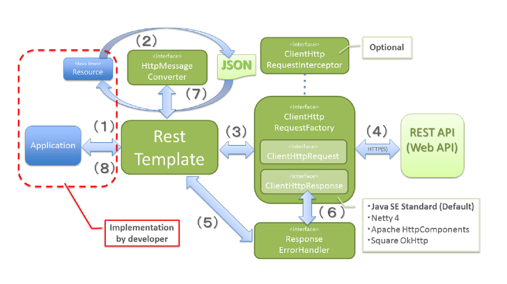

# RestTemplate
<table style="border-collapse: collapse; width: 100%;" border="1" data-ke-style="style12"><tbody><tr><td>
메서드
</td><td>
HTTP
</td><td>
설명
</td></tr><tr><td>
getForObject
</td><td>
GET
</td><td>
주어진 URL 주소로 HTTP GET 메서드로 객체로 결과를 반환받는다
</td></tr><tr><td>
getForEntity
</td><td>
GET
</td><td>
주어진 URL 주소로 HTTP GET 메서드로 결과는 ResponseEntity로 반환받는다
</td></tr><tr><td>
postForLocation
</td><td>
POST
</td><td>
POST 요청을 보내고 결과로 헤더에 저장된 URI를 결과로 반환받는다
</td></tr><tr><td>
postForObject
</td><td>
POST
</td><td>
POST 요청을 보내고 객체로 결과를 반환받는다
</td></tr><tr><td>
postForEntity
</td><td>
POST
</td><td>
POST 요청을 보내고 결과로 ResponseEntity로 반환받는다
</td></tr><tr><td>
delete
</td><td>
DELETE
</td><td>
주어진 URL 주소로 HTTP DELETE 메서드를 실행한다
</td></tr><tr><td>
headForHeaders
</td><td>
HEADER
</td><td>
헤더의 모든 정보를 얻을 수 있으면 HTTP HEAD 메서드를 사용한다
</td></tr><tr><td>
put
</td><td>
PUT
</td><td>
주어진 URL 주소로 HTTP PUT 메서드를 실행한다
</td></tr><tr><td>
patchForObject
</td><td>
PATCH
</td><td>
주어진 URL 주소로 HTTP PATCH 메서드를 실행한다
</td></tr><tr><td>
optionsForAllow
</td><td>
OPTIONS
</td><td>
주어진 URL 주소에서 지원하는 HTTP 메서드를 조회한다
</td></tr><tr><td>
exchange
</td><td>
any
</td><td>
HTTP 헤더를 새로 만들 수 있고 어떤 HTTP 메서드도 사용가능하다
</td></tr><tr><td>
execute
</td><td>
any
</td><td>
Request/Response 콜백을 수정할 수 있다
</td></tr></tbody></table>

  

# RestTemplate의 동작원리

1. 어플리케이션이 RestTemplate를 생성하고, URI, HTTP메소드 등의 헤더를 담아 요청한다.
2. RestTemplate 는 HttpMessageConverter 를 사용하여 requestEntity 를 요청메세지로 변환한다.
3. RestTemplate 는 ClientHttpRequestFactory 로 부터 ClientHttpRequest 를 가져와서 요청을 보낸다.
4. ClientHttpRequest 는 요청메시지를 만들어 HTTP 프로토콜을 통해 서버와 통신한다.
5. RestTemplate 는 ResponseErrorHandler 로 오류를 확인하고 있다면 처리로직을 태운다.
6. ResponseErrorHandler 는 오류가 있다면 ClientHttpResponse 에서 응답데이터를 가져와서 처리한다.
7. RestTemplate 는 HttpMessageConverter 를 이용해서 응답메세지를 Java object(Class responseType)로 변환한다.
8. 어플리케이션에 반환한다.

